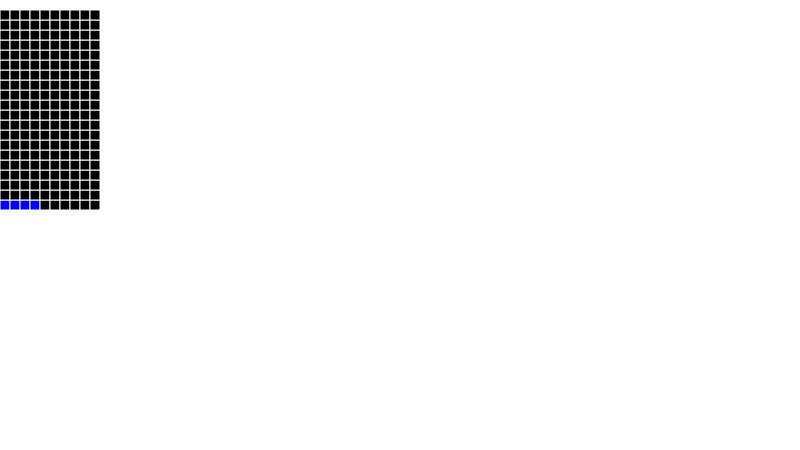
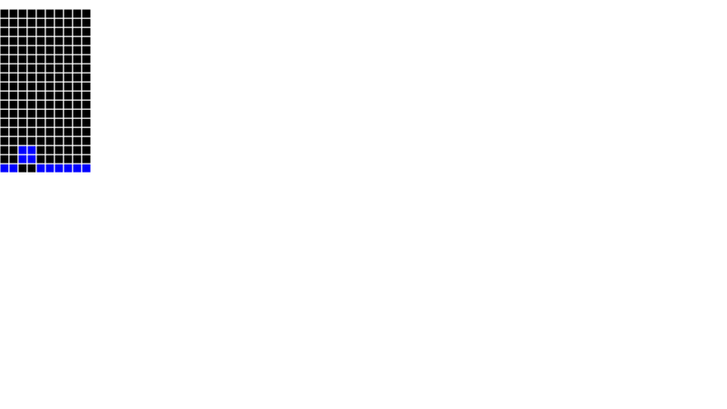

# Tetris
> Simplified Tetris engine.


This file will become your README and also the index of your documentation.

## Install

`poetry install`

## How to use

`./tetris.py <input.txt >output.txt`

```python
pf = Playfield()
pf
```


    

    


```python
i = Piece("****")
i
```


    

    


```python
pf.add(i, 0)
pf
```


    

    


```python
pf.height
```


    1


```python
loader = PieceLoader()
```

```python
from IPython.display import SVG, display

    
for name, piece in loader.pieces.items():
    print(name)
    display(SVG(piece._repr_svg_()))

```

    i


    

    


    z


    

    


    t


    

    


    s


    

    


    j


    

    


    q


    

    


    l


    

    


```python
from tetris.controller import Controller

c = Controller()
pf = c.process('I0,I4,Q8')
```

```python
pf = c.process('T1,Z3,I4')
```

```python
c.process('Q0,I2,I6,I0,I6,I6,Q2,Q4')
```


    

    


