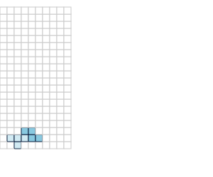
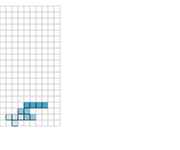
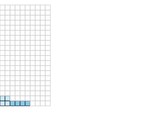
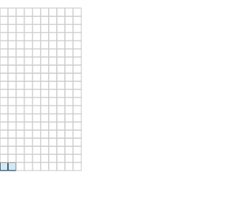
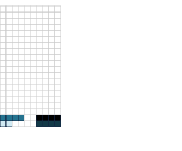
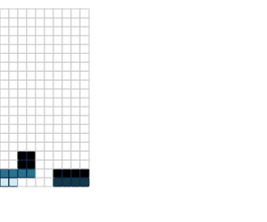
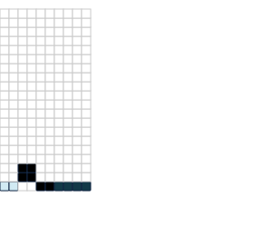

# Tetris
> Simplified Tetris engine.


Objects to simulate some primitive operations in the game of Tetris.

## How to use

Execute `main.py` to run test input and print resulting line height to stdout:

`./main.py <input.txt >output.txt`

## Install Optional Dependencies

The basic program should work without external dependencies. In order to execute Jupyter Notebook, work with renderer, etc:

`poetry install`

The project is implemented as an [nbdev](https://github.com/fastai/nbdev) notebook. Docs are generated from notebooks in literate programming fashion best viewed on Github or in Jupyter Notebook.

## Testing

Tests are run against the notebooks and CI executed in Github Actions (`./.github/workflows`).

Can be run from dev machine via:

$ `nbdev_test_nbs`

## The Class Library

```python
from tetris.core import *
from tetris.piece import Piece
from tetris.playfield import Playfield
from tetris.piece_loader import PieceLoader
from tetris.renderer import Renderer
```

## Playfield and Renderer

## Run interactively in Jupyter Notebook

Game objects are easily instantiated and rendered inside a Jupyter session:

```python
pf = Playfield()
rndr = Renderer()
rndr.playfield_to_svg(pf)
```


    

    


## Piece

Instantiated with a row per line, pieces are described as strings. `*` for brick present, `-` for negative space.

```python
i = Piece("****")
rndr.piece_to_svg(i)
```


    

    


```python
pf.add(i, 0) # i piece added at column 0
rndr.playfield_to_svg(pf)
```


    

    


```python
pf.height
```


    1


## PieceLoader

Loads known piece definitions from a given data directory.

```python
loader = PieceLoader()
```

```python
from IPython.display import SVG, display

    
for name, piece in loader.pieces.items():
    print(name)
    display(rndr.piece_to_svg(piece))
```

    i


    

    


    z


    

    


    t


    

    


    s


    

    


    j


    

    


    q


    

    


    l


    

    


## Controller

Implements a method `process` which can take a comma-delimited series of instructions `<piece><column>`. Pieces are added and lines are cleared. Takes an optional `Renderer`, renders SVG of current `Playfield` after every add/clear when run from Jupyter Notebook.

```python
from tetris.controller import Controller

c = Controller()
```

## Example 1

```python
pf = c.process('I0,I4,Q8', rndr)
```


    

    


    

    


    

    


```python
assert(pf.height == 1)
```

```python
pf = c.process('T1,Z3,I4', rndr)
```


    

    


    

    


    

    


```python
assert(pf.height == 4)
```

## Example 3

```python
pf = c.process('Q0,I2,I6,I0,I6,I6,Q2,Q4', Renderer())
```


    

    


    

    


    

    


    

    


    

    


    

    


    

    


    

    


```python
assert(pf.height == 3)
```
